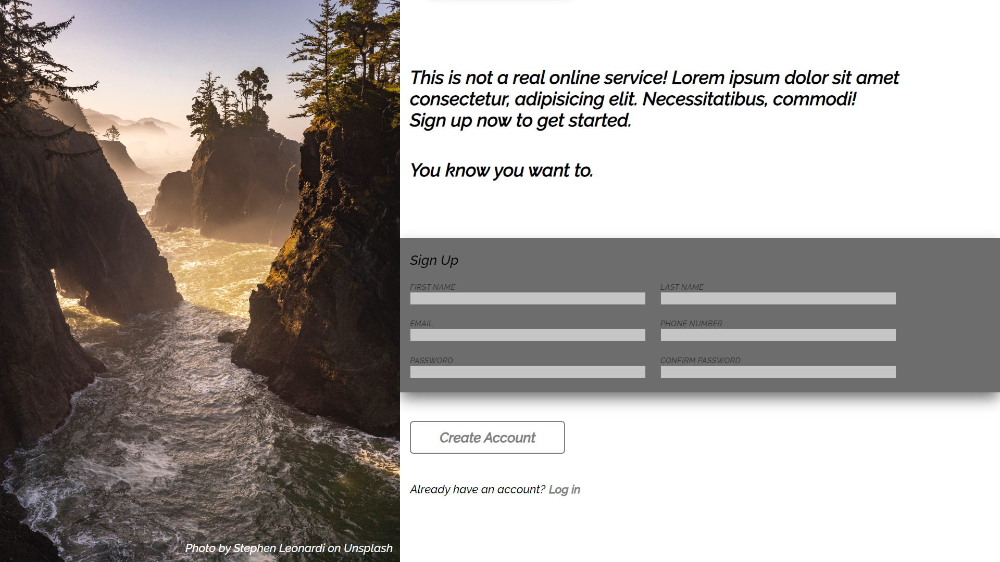

# Sign-Up Page

This is a simple sign-up page template created with HTML and CSS. It provides a clean and responsive design for user registration.

## Table of Contents

- [Features](#features)
- [Demo](#demo)
- [License](#license)

## Features

- Responsive design for both desktop and mobile devices.
- Input validation for required fields.
- Stylish form elements and buttons.
- Easily customizable with CSS variables.
- Background image with attribution to [Stephen Leonardi on Unsplash](https://unsplash.com/photos/Xwjt2gkLQB8).

## Demo

You can see a live demo of this sign-up page [here](https://rsignup.netlify.app).

## License

This project is licensed under the MIT License.
